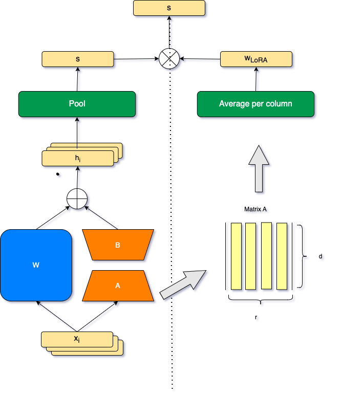

# LoRA_for_IR
##
This is a repo for finetune LLM by LoRA on Retrieval task.
We design two methods to re-weight the sentence embedding by element-wise multiplication with LoRA matrix.
The overview can be described by picture below:
<!--  -->


## Usage
```
conda create -n LoRA_for_IR python=3.10
conda activate LoRA_for_IR
git clone git@github.com:Kaiwang11/LoRA_for_IR.git
cd LoRA_for_IR
pip install -e.
```
### Data Loading

To download the data, run the following command:
```
python data_load.py
```

```bash
python src/main.py \
-epoch 1\
-d nfcorpus\ #dataset name
-exp_name experiment name\ #name of checkpoint.
-dora False\
-vera False\
```
For more help :
```bash
python src/main.py -h 
```

